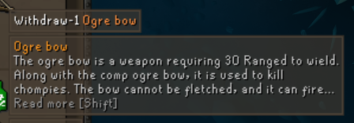
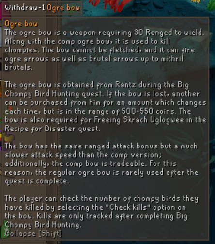
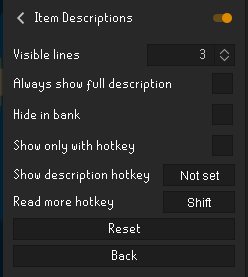

# Item Descriptions

A RuneLite plugin that shows Old School RuneScape Wiki descriptions when hovering over items.

## Features

- Shows a short item description on hover
- Displays 3 lines by default
- Press **Shift** to expand or collapse the full description
- Holding **Shift** keeps descriptions expanded while moving between items
- Optional setting to always show the full description
- Optional setting to only show descriptions while holding a hotkey
- Optional setting to hide descriptions in the bank

## Default settings

- Visible lines: `3`
- Always show full description: `Off`
- Hide in bank: `Off`
- Show only with hotkey: `Off`
- Show description hotkey: `Not set`
- Read more hotkey: `Shift`

Descriptions are provided by the Old School RuneScape Wiki.

## Screenshots

### Collapsed description

### Expanded description

### Settings

