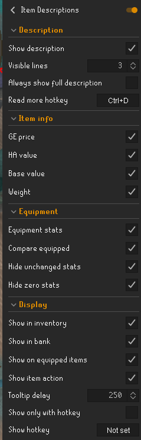

# Item Descriptions

A RuneLite plugin that shows Old School RuneScape Wiki descriptions and additional item information when hovering over
items.

## Features

- Shows an Old School RuneScape Wiki description when hovering over an item
- Press **Ctrl+D** to expand or collapse the full description
- Holding **Ctrl+D** keeps descriptions expanded while moving between items
- Optional setting to always show the full description
- Optional setting to only show item information while holding a configured hotkey
- Configurable tooltip delay
- Supports inventory, bank and equipped items
- Optionally shows the current item action next to the item name
- Shows Grand Exchange price
- Shows High Alchemy value
- Optionally shows base item value
- Shows item weight
- Shows equipment attack, defence and other bonuses
- Optionally compares equipment stats with currently equipped gear
- Stack prices include total value and unit price

## Default settings

- Visible lines: `3`
- Always show full description: `Off`
- Hide in bank: `Off`
- Show only with hotkey: `Off`
- Show description hotkey: `Not set`
- Read more hotkey: `Shift`

Descriptions are provided by the Old School RuneScape Wiki.

## Screenshots

### Collapsed description

### Expanded description

### Item stats

### Settings

